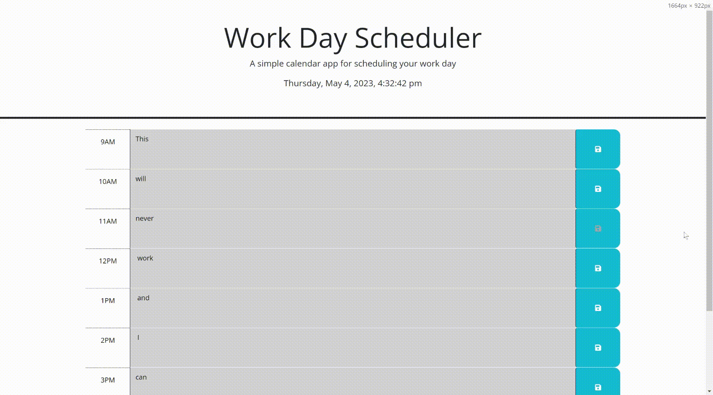

# 05-Challenge-WorkDayScheduler

### **[Description](#description) | [Installation](#installation) | [Usage](#usage) | [Credits](#credits) | [License](#license)**

## Description

The goal was to utilize third-party APIs to create a function work day scheduler that can provide the time and save the user input. This helps the user keep track of tasks, whether is be one-time or reoccuring.

I learned a great deal about the applications of third-party APIs and how to use them to create a responsive webpage, similar to Web-APIs. Additionaly, this helped solidify what I have learned so far with JavaScript and Web-APIs. I still struggle with local storage, but this challenge definitely helped since I was able to get that working quicker than my previous attempts.

## Installation

No installation is required. See the following link to access the website: https://itsa-me-dea.github.io/05-Challenge-WorkDayScheduler/

## Usage

Enter your task into the desired text box. If you click the save button, this will save your input onto your local storage and will remain upon refreshing the page.

To remove/replace these saved inputs, you can override the save with an empty text box or you can use the DevTools (`Ctrl+Shift+I` for Windows or `Command+Option+I` for Mac), navigate to the Application tab, open Local Storage under Storage, and right-click to clear/delete all/one value(s).

NOTE: Grey text boxes indicate time past, while the red indicated present time, and green is for future times.

## Credits

* JQuery: https://api.jquery.com
* Day.js: https://day.js.org/docs/en/display/format
* JQuery DOM interaction: https://www.w3schools.com/jquery/jquery_syntax.asp#:~:text=The%20Document%20Ready%20Event&text=This%20is%20to%20prevent%20any,ready%20before%20working%20with%20it
* Getting parent id with JQuery: https://stackoverflow.com/questions/10260667/jquery-get-parent-parent-id
* Removing a class with JQuery: https://api.jquery.com/removeclass/
* Setting up a real-time clock: (https://stackoverflow.com/questions/39418405/making-a-live-clock-in-javascript)
* A variety of topics and code were utilized and adapted from UCSD-VIRT-FSF-PT-03-2023-U-LOLC/03-JavaScript/01-Activities
* A variety of topics and code were utilized and adapted from UCSD-VIRT-FSF-PT-03-2023-U-LOLC/03-Web-APIs/01-Activities
* A variety of topics and code were utilized and adapted from UCSD-VIRT-FSF-PT-03-2023-U-LOLC/03-Third-Party-APIs/01-Activities
* **Note:** If I missed a link, it should be listed in the code comments with the adapted code following below said comment.

## License

Please refer to the [LICENSE](/LICENSE) within the repository.
